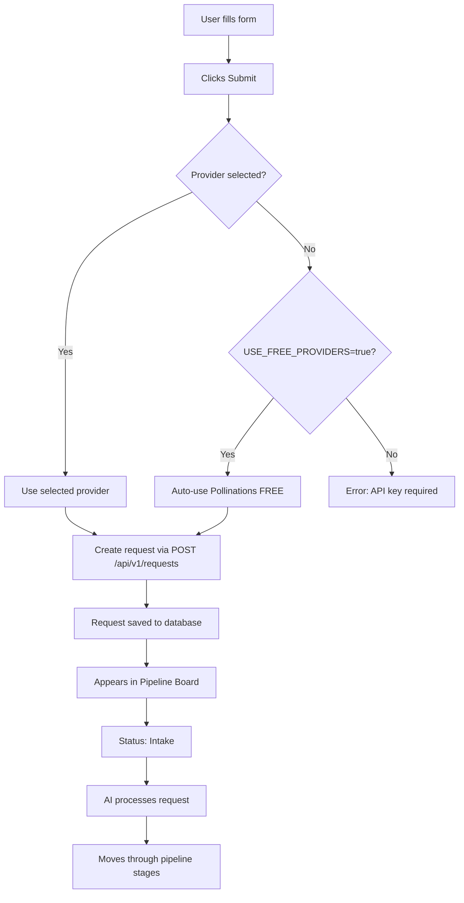

# How to Use the Creative Request System 🎬

## Quick Summary

✅ **Campaign Dropdown**: Already fetches **real campaigns** from database  
✅ **Free Provider Auto-Fallback**: Works automatically when you don't select a provider  
✅ **All Form Sections**: Fully functional and send data to backend  

---

## 1. Campaign Dropdown - Already Fixed! ✅

### Current Behavior
The campaign dropdown in the navbar **already fetches real campaigns** from your database via the `/api/v1/campaigns` endpoint.

**Code:** `components/CampaignSelector.tsx` (Line 20-27)
```typescript
const { data: campaignsData, isLoading } = useCampaigns();

const campaigns: Campaign[] = Array.isArray(campaignsData) 
  ? campaignsData 
  : (campaignsData as unknown as { data?: Campaign[] })?.data || [];

// Filter to only show active campaigns
const activeCampaigns = campaigns.filter(c => 
  !c.deleted_at && 
  !['archived', 'pending_deletion'].includes(c.status)
);
```

### Why You Might See "Campaign 1"
If you see "Campaign 1" in the dropdown, it's because:
1. **That's an actual campaign in your database**
2. The database seeding script created it as sample data

### How to Check Your Real Campaigns
```bash
# Option 1: Check via Supabase dashboard
# Go to: https://supabase.com/dashboard
# Select your project → Table Editor → campaigns table

# Option 2: Check via API
curl http://localhost:3000/api/v1/campaigns

# Option 3: Check via SQL
# In Supabase SQL Editor:
SELECT id, campaign_name, status, created_at 
FROM campaigns 
WHERE deleted_at IS NULL 
  AND status NOT IN ('archived', 'pending_deletion')
ORDER BY created_at DESC;
```

### How to Create New Campaigns
1. Click the **"+ New Campaign"** button in the dropdown
2. Or navigate to `/campaigns?create=true`
3. Fill in campaign details and save

---

## 2. How Free Provider Auto-Fallback Works 🆓

### Automatic Selection Logic

When you **don't explicitly select an image/video provider**, the system uses this hierarchy:

```
User makes request (no provider specified)
  ↓
System tries to use user's OpenAI/Pollo API key
  ↓
No API key found?
  ↓
Check: USE_FREE_PROVIDERS=true in .env.local?
  ↓
YES → Automatically use Pollinations.ai (FREE)
NO → Show error "API key required"
```

### Configuration

**In `.env.local`:**
```bash
# Enable auto-fallback to free providers
USE_FREE_PROVIDERS=true
REQUIRE_USER_PROVIDER_KEYS=true

# Free provider models (user can override in Settings)
POLLINATIONS_IMAGE_MODEL=flux
POLLINATIONS_VIDEO_MODEL=mochi
```

### User Override in Settings

Users can customize Pollinations models:
1. Go to **Settings → Preferences → Automation**
2. Toggle **"Use Free Providers"** ON
3. Select preferred models from dropdowns:
   - Image: Flux, Flux Realism, Flux Anime, Flux 3D, Turbo
   - Video: Mochi

---

## 3. Creative Request Form - Complete Flow 📋

### Form Sections Explained

#### **Section 1: Basic Info** ✅
**Fields:**
- **Title**: Name of the creative asset
- **Campaign**: Dropdown of real campaigns from database
- **Content Type**: Video with VO / Video no VO / Image

**What happens:**
```javascript
// Sent to API as:
{
  title: "Launch product reel",
  campaign_id: "actual-uuid-from-database",
  type: "video_with_vo" // or "video_no_vo" or "image"
}
```

---

#### **Section 2: Creative Settings** ✅
**Fields:**
- **Duration**: 15s / 30s / 60s (for videos)
- **Provider**: Pollo / Sora 2 / Runway / Pollinations / etc.
  - ⚠️ **If empty**: Auto-uses Pollinations if `USE_FREE_PROVIDERS=true`
- **Voice**: ElevenLabs options (for video-with-vo)
- **Aspect Ratio**: 16:9 / 9:16 / 1:1 / 4:5
- **Style**: Realistic / Animated / Cinematic / 3D / Sketch
- **Shot Type**: Close-up / Wide / Medium / POV / Aerial

**What happens:**
```javascript
// Sent to API as:
{
  requirements: {
    duration: 30,
    aspect_ratio: "16:9",
    style_preset: "Realistic",
    shot_type: "Medium",
    voice_id: "ElevenLabs - Calm" // only if video-with-vo
  },
  settings: {
    provider: "Pollo" // or empty for auto-fallback
  }
}
```

**Free Provider Behavior:**
- **Provider empty + USE_FREE_PROVIDERS=true** → Uses Pollinations automatically
- **Provider selected** → Uses that specific provider (requires API key)

---

#### **Section 3: Script & Content** ✅
**Fields:**
- **Auto-generate script**: Toggle ON/OFF
  - **ON**: AI writes script from your prompt
  - **OFF**: You provide custom script text
- **Prompt/Script**: Your creative brief or custom script

**What happens:**
```javascript
// Auto-script ON (AI generates):
{
  settings: {
    auto_script: true
  },
  requirements: {
    prompt: "30s product demo, upbeat, Gen Z tone..."
  }
}

// Auto-script OFF (custom):
{
  settings: {
    auto_script: false,
    script_text: "Your custom script here..."
  }
}
```

---

#### **Section 4: AI & Budget** ✅
**Fields:**
- **AI Model**: Select from dropdown (uses your Settings preferences)
- **Knowledge Bases**: Select brand context (optional)
- **Estimate Button**: Shows cost and time estimate

**What happens:**
```javascript
// 1. Click "Estimate" → Calls /api/v1/requests/estimate
POST /api/v1/requests/estimate
{
  type: "video_with_vo",
  duration: 30,
  provider: "Pollo",
  hasVoiceover: true
}

// Response:
{
  estimated_cost: 2.50,
  estimated_time_seconds: 300 // 5 minutes
}

// 2. Shows in UI: "$2.50 • ~5 min"
```

---

### Complete Request Submission Flow



**API Endpoint:** `POST /api/v1/requests`

**Request Body:**
```json
{
  "brand_id": "uuid-from-database",
  "campaign_id": "selected-campaign-uuid",
  "title": "Launch product reel",
  "type": "video_with_vo",
  "requirements": {
    "prompt": "30s product demo...",
    "duration": 30,
    "aspect_ratio": "16:9",
    "style_preset": "Realistic",
    "shot_type": "Medium",
    "voice_id": "ElevenLabs - Calm"
  },
  "settings": {
    "provider": "Pollo", // or empty for auto-fallback
    "tier": "standard",
    "auto_script": true,
    "selected_kb_ids": []
  }
}
```

**Success Response:**
```json
{
  "success": true,
  "data": {
    "request_id": "new-request-uuid",
    "status": "intake",
    "created_at": "2026-01-08T..."
  }
}
```

**What happens next:**
1. Request appears in **Pipeline Board** (rightside)
2. Starts in **"Intake"** column
3. AI generates creative brief
4. Moves to **"Draft"** → **"Production"** → **"QA"** → **"Published"**

---

## 4. Testing the Complete Flow 🧪

### Test 1: Free Provider (No API Key Needed)

```bash
# 1. Ensure free providers enabled
# In .env.local:
USE_FREE_PROVIDERS=true

# 2. Create request:
- Title: "Test Image"
- Campaign: Select any from dropdown
- Content Type: Image
- Provider: LEAVE EMPTY ← Important!
- Prompt: "Beautiful mountain landscape"
- Click Submit

# Expected: 
✅ Request created successfully
✅ Uses Pollinations (FREE)
✅ Cost: $0.00
✅ Appears in Pipeline Board
```

### Test 2: Paid Provider (API Key Required)

```bash
# 1. Add API key in Settings:
Settings → API Keys → Add OpenAI key

# 2. Create request:
- Title: "High Quality Image"
- Campaign: Select any
- Content Type: Image
- Provider: "DALLE-3" ← Selected
- Quality: HD
- Click Estimate → See cost
- Click Submit

# Expected:
✅ Uses OpenAI DALLE-3
✅ Cost: ~$0.04-$0.08
✅ Higher quality output
```

### Test 3: Complete Video with VO

```bash
# 1. Create request:
- Title: "Product Launch Video"
- Campaign: Select campaign
- Content Type: "Video with VO"
- Duration: 30s
- Provider: LEAVE EMPTY (uses Pollinations)
- Voice: "ElevenLabs - Calm"
- Aspect Ratio: 16:9
- Style: Cinematic
- Auto-script: ON
- Prompt: "Exciting product reveal, upbeat music, show features"
- Click Estimate
- Click Submit

# Expected:
✅ FREE video generation (Pollinations)
✅ FREE voiceover (Pollinations TTS)
✅ Total cost: $0.00
✅ Appears in pipeline
```

---

## 5. Common Questions ❓

### Q: Why is the provider field empty by default?
**A:** To enable **smart auto-fallback**:
- Empty = System picks best option (free tier if available)
- Selected = Use that specific provider

### Q: How do I know if I'm using free or paid providers?
**A:** Check the **estimate**:
- **$0.00** = Using free tier (Pollinations)
- **$0.04+** = Using paid provider (DALLE, Sora, etc.)

### Q: Can I force free providers even if I have API keys?
**A:** Yes! Two ways:
1. **Settings → Use Free Providers** toggle ON
2. **Don't select a provider** in the form (leave empty)

### Q: What if I select a provider but have no API key?
**A:** 
- **USE_FREE_PROVIDERS=true** → Auto-falls back to Pollinations
- **USE_FREE_PROVIDERS=false** → Error: "API key required"

### Q: How do I customize Pollinations models?
**A:** 
1. **Settings → Preferences → Automation**
2. Toggle **"Use Free Providers"** ON
3. Select from dropdown:
   - Flux / Flux Realism / Flux Anime / Flux 3D / Turbo
4. Your preference auto-applies to all requests

---

## 6. Form Validation Rules ⚠️

**Required fields:**
- ✅ Title (can't be empty)
- ✅ Campaign (auto-selects first if none chosen)
- ✅ Content Type (defaults to "video-with-vo")
- ✅ Prompt/Script (can't be empty)

**Optional fields:**
- Duration (defaults to 30s for videos)
- Provider (auto-selects free tier if empty)
- Voice (only for video-with-vo)
- Knowledge Bases (optional context)

**Validation errors:**
```javascript
// No title
alert('Please enter a title');

// No provider AND no auto-fallback
alert('Please select a provider');

// No prompt
alert('Please provide a creative prompt');
```

---

## 7. Cost Examples 💰

| Request Type | Provider | Cost | Speed |
|-------------|----------|------|-------|
| **Image (1024x1024)** | Pollinations (Free) | **$0.00** | Fast |
| **Image (1024x1024)** | DALLE-3 Standard | $0.04 | Medium |
| **Image (1024x1024)** | DALLE-3 HD | $0.08 | Medium |
| **Video (30s, no VO)** | Pollinations (Free) | **$0.00** | Fast |
| **Video (30s, no VO)** | Pollo Kling | $1.50 | Medium |
| **Video (30s, no VO)** | Sora 2 | $5.00 | Slow |
| **Video (30s, with VO)** | Pollinations (Free) | **$0.00** | Fast |
| **Video (30s, with VO)** | Pollo + ElevenLabs | $2.50 | Medium |

**Savings with Free Tier:**
- 100 images: **$4-8 saved**
- 10 videos: **$15-50 saved**
- Monthly: **$100-500+ saved**

---

## 8. Pipeline Board Explained 📊

After submitting a request, it appears in the **Pipeline Board** (right side):

### **Column Flow:**
```
1. Intake     → Request received, queued
2. Draft      → AI generating brief + script
3. Production → Creating actual asset
4. QA         → Quality review
5. Published  → Ready to use
```

### **Request Card Shows:**
- Title
- Type (video/image icon)
- Status badge
- Timestamp
- Campaign name

### **Click a card to see:**
- Full details
- AI-generated brief
- Generated assets
- Cost breakdown
- Approval/reject options

---

## Summary Checklist ✅

**Campaign Dropdown:**
- ✅ Fetches real campaigns from database
- ✅ Auto-selects first campaign if none chosen
- ✅ Filters out archived/deleted campaigns
- ✅ Shows "Campaign 1" if that's in your database (real data, not mock)

**Free Provider Auto-Fallback:**
- ✅ Works when provider field is empty
- ✅ Requires `USE_FREE_PROVIDERS=true` in .env
- ✅ Uses Pollinations for $0.00 cost
- ✅ User can customize models in Settings

**Form Sections:**
- ✅ Basic Info → Sends title, campaign, type
- ✅ Creative Settings → Sends duration, voice, style, shot type
- ✅ Script & Content → Sends prompt or custom script
- ✅ AI & Budget → Shows estimate, saves to database

**Request Flow:**
- ✅ Submit → POST /api/v1/requests
- ✅ Appears in Pipeline Board
- ✅ AI processes request
- ✅ Asset generated
- ✅ Cost tracked
- ✅ Ready for approval/publish

---

🎉 **Everything is fully functional and ready to use!**
