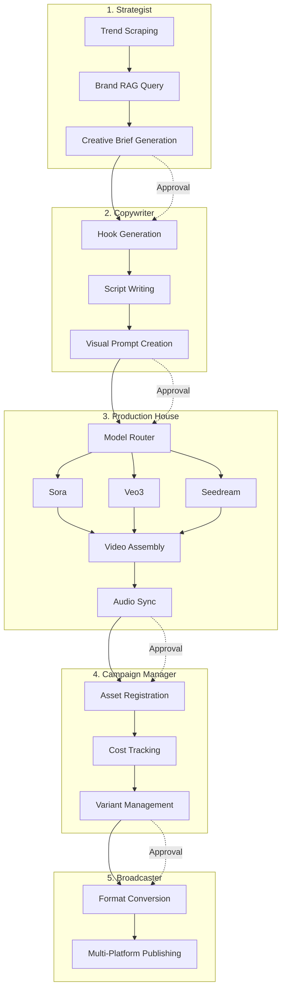
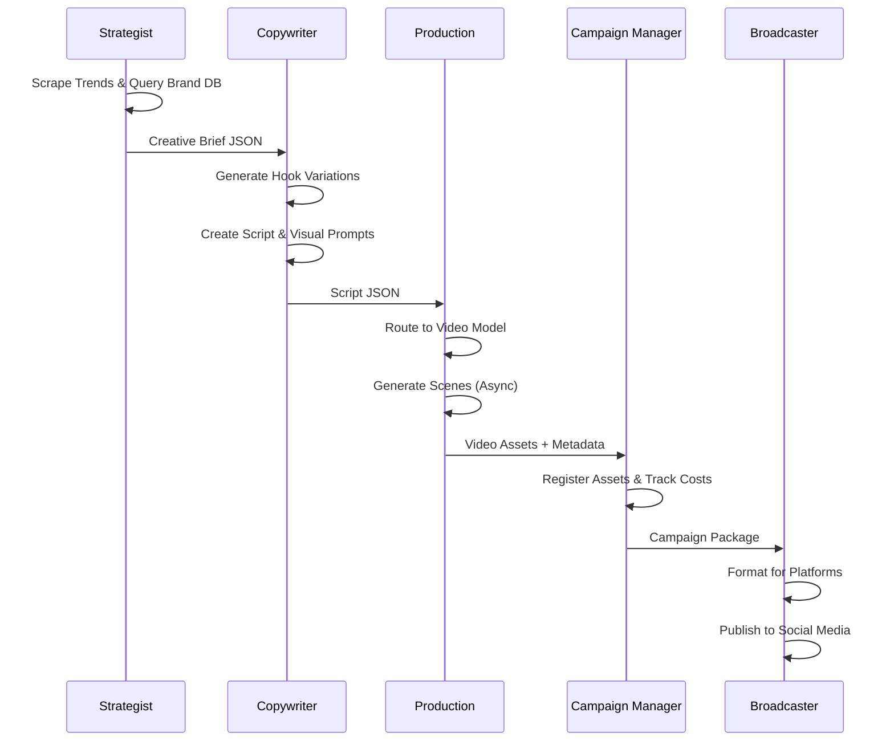
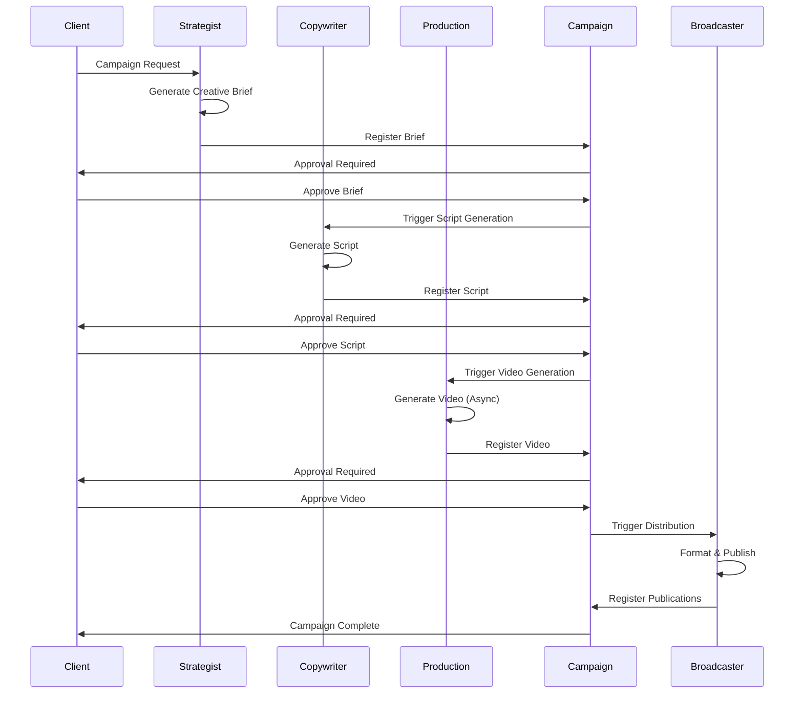
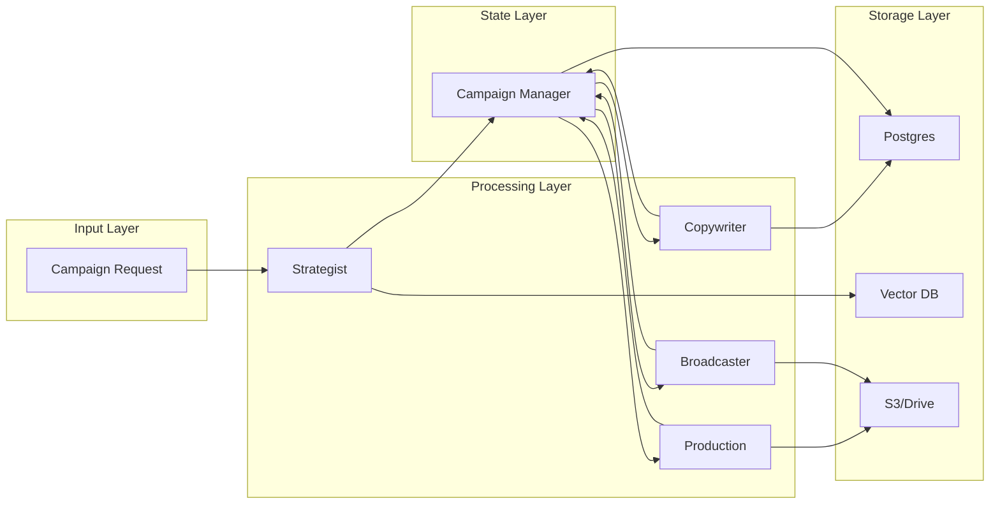
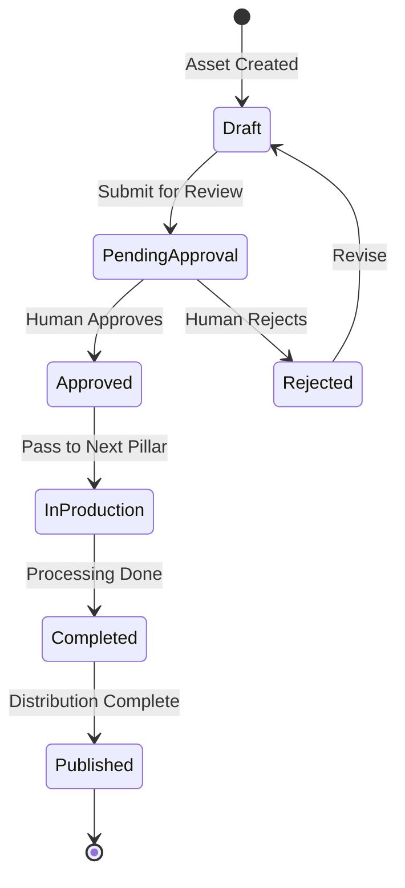

# Brand Infinity Engine: Marketing Content Pipeline Architecture

## Executive Summary

The **Brand Infinity Engine** is a massive-scale **Text-to-Campaign** pipeline designed to generate high-fidelity, cinematic marketing videos at production scale. This architecture document deconstructs the n8n workflow library into 5 operational pillars, each analyzed across 15 distinct engineering dimensions.

**Core Principles:**
- **Commercial Impact:** Every output designed to convert with viral hooks and visual spectacle
- **Brand Safety:** Strict adherence to brand guidelines (tone, color grading, restricted keywords)
- **Cinematic Fidelity:** Super Bowl quality AI video using Sora/Veo3

---

## Table of Contents

1. [System Architecture Overview](#system-architecture-overview)
2. [Pillar 1: The Strategist (Market Intelligence)](#pillar-1-the-strategist-market-intelligence)
3. [Pillar 2: The Copywriter (Creative Direction)](#pillar-2-the-copywriter-creative-direction)
4. [Pillar 3: The Production House (Visual Synthesis)](#pillar-3-the-production-house-visual-synthesis)
5. [Pillar 4: The Campaign Manager (State & Ledger)](#pillar-4-the-campaign-manager-state--ledger)
6. [Pillar 5: The Broadcaster (Distribution & Formatting)](#pillar-5-the-broadcaster-distribution--formatting)
7. [Cross-Pillar Integration Patterns](#cross-pillar-integration-patterns)

---

## System Architecture Overview

### High-Level Data Flow



### Pillar Interaction Model



---

## Pillar 1: The Strategist (Market Intelligence)

**Mandate:** The Trend Hunter - Market intelligence and brand alignment

**Source Workflows:**
- `Agentic RAG Template.json` - RAG infrastructure for brand knowledge base
- Scraper workflows (adapted for competitor analysis and trend detection)

### 1. Input/Output Contract

**Input Schema:**
```json
{
  "campaign_request": {
    "product_category": "string",
    "target_demographic": "string",
    "campaign_objective": "awareness|conversion|engagement",
    "budget_tier": "premium|standard|volume",
    "brand_id": "uuid"
  }
}
```

**Output Schema:**
```json
{
  "creative_brief": {
    "brief_id": "uuid",
    "target_audience": {
      "demographics": "object",
      "psychographics": "array",
      "pain_points": "array"
    },
    "core_message": {
      "primary_hook": "string",
      "value_proposition": "string",
      "call_to_action": "string"
    },
    "trending_insights": {
      "trending_topics": "array",
      "trending_audio": "array",
      "competitor_analysis": "object",
      "viral_patterns": "array"
    },
    "brand_guidelines_ref": {
      "tone": "string",
      "color_palette": "array",
      "restricted_keywords": "array",
      "visual_style": "string"
    },
    "variant_suggestions": [
      {
        "variant_type": "humorous|serious|emotional|educational",
        "rationale": "string"
      }
    ],
    "generated_at": "timestamp",
    "approval_status": "pending|approved|rejected"
  }
}
```

### 2. Brand Consistency

**Mechanisms:**
- **RAG-Based Brand Bible Querying:** Vector similarity search against brand guidelines stored in vector database (Pinecone/Supabase Vector)
- **Similarity Thresholds:** Minimum 0.85 cosine similarity for brand alignment
- **Multi-Layer Validation:**
  - Tone checker against brand voice embeddings
  - Keyword filtering against restricted terms list
  - Visual style matching against approved aesthetic patterns
- **Fallback Behavior:** If brand alignment score < 0.85, brief generation halts and requires human review

**Implementation Pattern:**
```
1. Query brand_guidelines vector store with campaign context
2. Retrieve top 5 most relevant brand documents
3. Extract tone, style, and restriction patterns
4. Validate creative brief against retrieved guidelines
5. Calculate brand alignment score
6. Gate: score >= 0.85 → proceed, else → human review
```

### 3. Model Selection Strategy

**Routing Logic:**
- **Trend Scraping:** Lightweight models (GPT-4o-mini, Claude Haiku) for data extraction
- **Competitor Analysis:** GPT-4o-mini for pattern recognition in ad libraries
- **Creative Brief Synthesis:** GPT-4o for comprehensive brief generation requiring nuanced understanding
- **Brand Alignment:** Vector search (no LLM) for fast brand guideline retrieval

**Cost Optimization:**
- Use cheaper models for high-volume scraping tasks
- Reserve GPT-4o for final brief synthesis only
- Cache brand guideline queries (TTL: 1 hour)

### 4. Async Orchestration

**Pattern:**
- **Scheduled Jobs:** Cron triggers for trend scraping (hourly)
- **Webhook Triggers:** Real-time updates when new competitor ads detected
- **Queue-Based Processing:** Brief generation requests queued for batch processing
- **Webhook Callbacks:** Notify downstream systems when brief ready

**Workflow:**
```
Schedule Trigger (Hourly) → Scrape Trends → Update Vector DB
Webhook (New Competitor Ad) → Analyze → Update Trend DB
API Request → Queue Brief Generation → Process → Webhook Callback
```

### 5. Viral Optimization

**Mechanisms:**
- **Trending Topic Extraction:** NLP analysis of social media feeds, news, and competitor channels
- **Hook Pattern Recognition:** ML model trained on viral ad hooks (pattern matching against historical data)
- **Competitor Ad Analysis:** 
  - Scrape competitor social media posts
  - Extract engagement metrics (likes, shares, comments)
  - Identify winning patterns (hook structure, visual style, timing)
- **Audio Trend Detection:** Integration with TikTok/Instagram trending audio APIs

**Output Enhancement:**
- Inject trending audio suggestions into creative brief
- Recommend hook structures based on current viral patterns
- Suggest optimal posting times based on competitor performance

### 6. Cost Efficiency

**Optimization Strategies:**
- **Cached Brand Queries:** Vector similarity results cached for 1 hour (brand guidelines change infrequently)
- **Batch Processing:** Group multiple brief requests for batch API calls
- **Selective Scraping:** Only scrape high-value sources (top competitors, major trend aggregators)
- **Incremental Updates:** Only process new/updated content, not full re-scrapes

**Cost Targets:**
- Brand query: <$0.01 per brief
- Trend scraping: <$0.10 per hour
- Brief generation: <$0.50 per brief

### 7. Error Propagation

**Validation Gates:**
1. **Input Validation:** Verify campaign_request schema before processing
2. **Brand Alignment Gate:** Reject briefs with alignment score < 0.85
3. **Completeness Check:** Ensure all required fields present in creative_brief
4. **Downstream Notification:** Only notify Copywriter if brief passes all gates

**Error Handling:**
- Invalid input → Return 400 error immediately
- Low brand alignment → Queue for human review, don't proceed
- API failures → Retry 3x with exponential backoff, then queue for manual processing

### 8. Asset Storage

**Storage Strategy:**
- **Vector DB (Pinecone/Supabase Vector):** Brand guidelines, trend embeddings, competitor ad patterns
- **Postgres:** Trend metadata, competitor ad URLs, brief history
- **Object Storage (S3/Drive):** Scraped competitor ad media (images/videos) for reference

**Data Lifecycle:**
- Brand guidelines: Permanent storage
- Trend data: 90-day retention, then archive
- Competitor ads: 180-day retention for pattern analysis

### 9. Human-in-the-Loop

**Approval Checkpoints:**
- **Brand Manager Review:** All creative briefs require approval before passing to Copywriter
- **Approval Interface:** Dashboard showing brief + brand alignment score + trend insights
- **Approval Actions:** Approve, Reject, or Request Revision
- **Revision Loop:** Rejected briefs return to Strategist with feedback for regeneration

**Workflow:**
```
Brief Generated → Status: "pending_approval" → Notification to Brand Manager
Brand Manager Reviews → Approve/Reject → If Approved → Status: "approved" → Trigger Copywriter
```

### 10. Data Persistence

**Postgres Schema:**

```sql
CREATE TABLE trends (
    trend_id UUID PRIMARY KEY DEFAULT gen_random_uuid(),
    topic TEXT NOT NULL,
    source TEXT NOT NULL,
    detected_at TIMESTAMP DEFAULT NOW(),
    engagement_score NUMERIC,
    category TEXT,
    metadata JSONB
);

CREATE TABLE brand_guidelines (
    guideline_id UUID PRIMARY KEY DEFAULT gen_random_uuid(),
    brand_id UUID NOT NULL,
    content TEXT NOT NULL,
    category TEXT, -- 'tone', 'visual_style', 'restrictions'
    embedding VECTOR(1536), -- OpenAI embedding dimension
    created_at TIMESTAMP DEFAULT NOW(),
    updated_at TIMESTAMP DEFAULT NOW()
);

CREATE TABLE competitor_ads (
    ad_id UUID PRIMARY KEY DEFAULT gen_random_uuid(),
    competitor_name TEXT NOT NULL,
    platform TEXT NOT NULL,
    ad_url TEXT,
    media_url TEXT,
    engagement_metrics JSONB,
    detected_at TIMESTAMP DEFAULT NOW(),
    analyzed_at TIMESTAMP,
    patterns JSONB
);

CREATE TABLE creative_briefs (
    brief_id UUID PRIMARY KEY DEFAULT gen_random_uuid(),
    campaign_request JSONB NOT NULL,
    creative_brief JSONB NOT NULL,
    brand_alignment_score NUMERIC,
    approval_status TEXT DEFAULT 'pending',
    approved_by UUID,
    approved_at TIMESTAMP,
    created_at TIMESTAMP DEFAULT NOW(),
    variant_tags TEXT[]
);
```

### 11. Copyright & Safety

**Compliance Mechanisms:**
- **Source Attribution:** All trend data includes source URL and timestamp
- **Content Filtering:** Scraped content filtered for inappropriate material before analysis
- **Competitor Ad Usage:** Only metadata and patterns extracted, not direct content reuse
- **Brand Restriction Enforcement:** Automated checking against restricted keywords and visual elements

**Audit Trail:**
- Log all data sources used in brief generation
- Track brand guideline queries for compliance verification
- Maintain attribution chain from trend → brief → final content

### 12. Latency Budgets

**Performance Targets:**
- Trend scraping: <2 minutes (background job)
- Brand guideline query: <500ms (cached) / <2s (uncached)
- Creative brief generation: <5 minutes end-to-end
- Approval workflow: Human-dependent (target: <24 hours)

**SLA:**
- 95th percentile brief generation: <5 minutes
- Brand query cache hit rate: >80%

### 13. Scalability

**Horizontal Scaling Strategy:**
- **Stateless Design:** Brief generation workers can scale horizontally
- **Queue-Based Architecture:** Brief requests queued, processed by worker pool
- **Database Read Replicas:** Brand guideline queries served from read replicas
- **Vector DB Sharding:** Brand guidelines sharded by brand_id for large multi-brand deployments

**Capacity Planning:**
- Single worker: ~12 briefs/hour
- Target: 100 concurrent brief generations
- Required: ~10 worker instances

### 14. Observability

**Key Metrics:**
- **Trend Detection Rate:** Number of new trends detected per hour
- **Brand Alignment Scores:** Distribution of alignment scores (target: >0.85)
- **Brief Generation Success Rate:** % of successful brief generations
- **Approval Time:** Average time from generation to approval
- **Cost per Brief:** Total cost / number of briefs generated

**Logging:**
- All brand queries logged with similarity scores
- Brief generation requests logged with timestamps
- Approval actions logged with user IDs

**Dashboards:**
- Real-time brief generation pipeline health
- Brand alignment score distribution
- Trend detection trends over time

### 15. A/B Testing Support

**Variant Tagging:**
- Creative briefs tagged with `variant_suggestions` array
- Each variant includes: `variant_type`, `rationale`, `expected_audience_response`
- Briefs can generate multiple variants for testing

**Tracking Integration:**
- Brief ID linked to final campaign performance
- Variant performance tracked through Campaign Manager
- Statistical analysis of variant effectiveness

**Schema Extension:**
```sql
ALTER TABLE creative_briefs ADD COLUMN variant_tags TEXT[];
-- Example: ['humorous', 'serious', 'emotional']
```

---

## Pillar 2: The Copywriter (Creative Direction)

**Mandate:** The Script & Storyboard Artist - Transform creative briefs into production-ready scripts

**Source Workflows:**
- `DeepSeek V3 Chat & R1 Reasoning Quick Start.json` - Reasoning for hook generation
- `16) Prompt Chaining.json` - Multi-step script refinement
- `Personalize marketing emails using customer data and AI.json` - Personalization patterns

### 1. Input/Output Contract

**Input Schema:** (Creative Brief from Strategist)
```json
{
  "creative_brief": {
    "brief_id": "uuid",
    "target_audience": {...},
    "core_message": {...},
    "trending_insights": {...},
    "brand_guidelines_ref": {...}
  }
}
```

**Output Schema:**
```json
{
  "script": {
    "script_id": "uuid",
    "brief_id": "uuid",
    "hook": {
      "text": "string",
      "hook_type": "question|statement|visual_shock|story",
      "quality_score": 0.0-1.0,
      "variations_generated": 50,
      "selected_rationale": "string"
    },
    "scenes": [
      {
        "scene_id": "uuid",
        "sequence": 1,
        "duration_seconds": 3-5,
        "visual_prompt": "string", // Dense cinematic prompt for video model
        "voiceover_text": "string",
        "visual_cues": {
          "style": "hyper_realistic|abstract|cinematic",
          "color_palette": "array",
          "camera_movement": "string",
          "lighting": "string"
        },
        "audio_cues": {
          "music_style": "string",
          "sfx": "array",
          "voice_tone": "string"
        }
      }
    ],
    "voiceover_full_text": "string", // Complete script for TTS
    "total_duration_seconds": 15-60,
    "variant_tag": "humorous|serious|emotional|educational",
    "brand_compliance_score": 0.0-1.0,
    "generated_at": "timestamp",
    "approval_status": "pending|approved|rejected"
  }
}
```

### 2. Brand Consistency

**Validation Mechanisms:**
- **Tone Checker:** LLM-based validation against brand voice embeddings
- **Script Validation:** Each scene validated for brand tone compliance
- **Visual Style Enforcement:** Visual prompts automatically include brand color palette and style guidelines
- **Restricted Keyword Scanning:** Automated scan for restricted terms in script

**Compliance Scoring:**
- Brand compliance score calculated per scene and overall script
- Minimum threshold: 0.90 for script approval
- Low-scoring scripts flagged for Creative Director review

### 3. Model Selection Strategy

**Routing Logic:**
- **Hook Generation:** DeepSeek R1 Reasoner for iterative hook refinement (50+ variations)
- **Script Writing:** GPT-4o for comprehensive script generation with brand context
- **Script Refinement:** Claude 3.5 Sonnet for nuanced editing and polish
- **Visual Prompt Creation:** GPT-4o for dense cinematic prompt generation

**Reasoning:**
- DeepSeek R1: Best for iterative reasoning tasks (hook generation requires "thinking through" multiple options)
- GPT-4o: Best for creative writing with brand constraints
- Claude: Best for refinement and subtle improvements

### 4. Async Orchestration

**Prompt Chaining Pattern:**
```
Step 1: Hook Generation (DeepSeek R1) → 50 variations
Step 2: Hook Selection (GPT-4o) → Score and select best
Step 3: Script Outline (GPT-4o) → Scene breakdown
Step 4: Scene Writing (GPT-4o) → Parallel generation
Step 5: Visual Prompt Creation (GPT-4o) → Per scene
Step 6: Script Refinement (Claude) → Final polish
```

**Webhook Callbacks:**
- Long-running hook generation (DeepSeek R1) uses webhook callback pattern
- Each step notifies next step via webhook when complete
- Failed steps trigger retry or human intervention

### 5. Viral Optimization

**Hook Scoring Algorithm:**
- **Psychological Persuasion Patterns:** ML model scores hooks on:
  - Curiosity gap
  - Emotional resonance
  - Pattern interrupt potential
  - Shareability factor
- **Historical Performance:** Hooks compared against database of high-performing hooks
- **Trend Alignment:** Hooks checked against current viral patterns from Strategist

**Optimization:**
- Generate 50 hook variations
- Score each variation
- Select top 3 for Creative Director review
- Final selection based on combination of AI score + human judgment

### 6. Cost Efficiency

**Optimization Strategies:**
- **Hook Template Library:** Cache successful hook patterns for reuse
- **Scene Template Reuse:** Reuse background scene descriptions across variants
- **Batch Processing:** Generate multiple scenes in parallel API calls
- **Cached Brand Queries:** Brand guideline queries cached (shared with Strategist)

**Cost Targets:**
- Hook generation (50 variations): <$2.00
- Full script generation: <$5.00
- Visual prompt creation: <$1.00

### 7. Error Propagation

**Quality Gates:**
1. **Hook Quality Gate:** Reject scripts if hook score < 0.75
2. **Brand Compliance Gate:** Reject if brand compliance score < 0.90
3. **Scene Completeness:** Verify all scenes have visual prompts and voiceover
4. **Duration Validation:** Ensure total duration within 15-60 second range

**Error Handling:**
- Low hook score → Regenerate hooks (max 3 attempts)
- Brand compliance failure → Flag for Creative Director review
- Incomplete scenes → Retry scene generation
- API failures → Exponential backoff retry, then queue for manual processing

### 8. Asset Storage

**Storage Strategy:**
- **Postgres:** Script versions, hooks, scene segments with full version history
- **Vector DB:** Hook patterns, successful script templates for pattern matching
- **Object Storage:** Reference images for visual style (if provided)

**Versioning:**
- All script versions stored (not overwritten)
- Version history tracked for audit and rollback
- Approved scripts marked as "production" version

### 9. Human-in-the-Loop

**Approval Checkpoints:**
- **Creative Director Review:** All scripts require approval before Production
- **Hook Selection:** Top 3 hooks presented for human selection
- **Script Revision:** Rejected scripts return with feedback for regeneration

**Approval Interface:**
- Dashboard showing: script, hook options, brand compliance score, visual prompts preview
- Side-by-side comparison of multiple variants
- One-click approval/rejection with optional feedback

### 10. Data Persistence

**Postgres Schema:**

```sql
CREATE TABLE scripts (
    script_id UUID PRIMARY KEY DEFAULT gen_random_uuid(),
    brief_id UUID REFERENCES creative_briefs(brief_id),
    hook JSONB NOT NULL,
    scenes JSONB NOT NULL,
    voiceover_full_text TEXT NOT NULL,
    total_duration_seconds INTEGER,
    variant_tag TEXT,
    brand_compliance_score NUMERIC,
    approval_status TEXT DEFAULT 'pending',
    approved_by UUID,
    approved_at TIMESTAMP,
    created_at TIMESTAMP DEFAULT NOW(),
    version INTEGER DEFAULT 1
);

CREATE TABLE hooks (
    hook_id UUID PRIMARY KEY DEFAULT gen_random_uuid(),
    script_id UUID REFERENCES scripts(script_id),
    hook_text TEXT NOT NULL,
    hook_type TEXT,
    quality_score NUMERIC,
    variation_number INTEGER,
    selected BOOLEAN DEFAULT FALSE,
    generated_at TIMESTAMP DEFAULT NOW()
);

CREATE TABLE scene_segments (
    scene_id UUID PRIMARY KEY DEFAULT gen_random_uuid(),
    script_id UUID REFERENCES scripts(script_id),
    sequence INTEGER NOT NULL,
    duration_seconds INTEGER,
    visual_prompt TEXT NOT NULL,
    voiceover_text TEXT NOT NULL,
    visual_cues JSONB,
    audio_cues JSONB,
    created_at TIMESTAMP DEFAULT NOW()
);

CREATE TABLE script_versions (
    version_id UUID PRIMARY KEY DEFAULT gen_random_uuid(),
    script_id UUID REFERENCES scripts(script_id),
    version_number INTEGER,
    script_data JSONB NOT NULL,
    created_at TIMESTAMP DEFAULT NOW(),
    created_by UUID
);
```

### 11. Copyright & Safety

**Compliance Mechanisms:**
- **Plagiarism Detection:** Scripts checked against database of existing scripts
- **Brand Guideline Compliance:** Automated checking against brand restrictions
- **Content Safety:** Scripts scanned for inappropriate content before approval
- **Attribution:** All AI-generated content watermarked with generation metadata

**Audit Trail:**
- Log all model calls with prompts and responses
- Track brand guideline queries
- Maintain version history for compliance verification

### 12. Latency Budgets

**Performance Targets:**
- Hook generation (50 variations): <10 minutes
- Script writing: <5 minutes
- Visual prompt creation: <2 minutes
- Full script generation: <10 minutes end-to-end
- Approval workflow: Human-dependent (target: <24 hours)

**SLA:**
- 95th percentile script generation: <10 minutes
- Hook quality score: >0.75

### 13. Scalability

**Horizontal Scaling Strategy:**
- **Parallel Scene Generation:** Scenes generated in parallel across worker pool
- **Hook Generation Queue:** Hook variations queued and processed by multiple workers
- **Stateless Workers:** Script generation workers can scale horizontally
- **Database Connection Pooling:** Efficient Postgres connection management

**Capacity Planning:**
- Single worker: ~6 scripts/hour
- Target: 50 concurrent script generations
- Required: ~10 worker instances

### 14. Observability

**Key Metrics:**
- **Hook Quality Scores:** Distribution of hook scores (target: >0.75)
- **Brand Compliance Scores:** Distribution (target: >0.90)
- **Script Generation Success Rate:** % of successful generations
- **Approval Time:** Average time from generation to approval
- **Cost per Script:** Total cost / number of scripts generated
- **Scene Generation Time:** Average time per scene

**Logging:**
- All model calls logged with timestamps and costs
- Hook generation iterations logged
- Approval actions logged with user IDs

**Dashboards:**
- Real-time script generation pipeline health
- Hook quality distribution
- Brand compliance score trends
- Cost tracking per script

### 15. A/B Testing Support

**Variant Tagging:**
- Scripts tagged with `variant_tag` (humorous, serious, emotional, educational)
- Multiple variants can be generated from same brief
- Variant performance tracked through Campaign Manager

**Tracking Integration:**
- Script ID linked to final video performance
- Variant performance compared statistically
- Winning variants inform future script generation

**Schema Support:**
```sql
-- Variant tags stored in scripts.variant_tag
-- Performance data linked via Campaign Manager
```

---

## Pillar 3: The Production House (Visual Synthesis)

**Mandate:** The Heavy Lifting - Transform scripts into high-fidelity video assets

**Source Workflows:**
- `Sora 2 Automation Skool Template.json` - Sora video generation with webhook polling
- `Automate video creation with Veo3 and auto-post to Instagram, TikTok via Blotato - vide.json` - Veo3 pipeline
- `Nano B Template.json` - Nano B image-to-video
- `Seedream 4.0 Template Skool.json` - Seedream generation

### 1. Input/Output Contract

**Input Schema:** (Script from Copywriter)
```json
{
  "script": {
    "script_id": "uuid",
    "scenes": [...],
    "voiceover_full_text": "string",
    "total_duration_seconds": 15-60
  }
}
```

**Output Schema:**
```json
{
  "video_assets": {
    "video_id": "uuid",
    "script_id": "uuid",
    "master_mp4_url": "string", // S3/Drive URL
    "master_duration_seconds": 15-60,
    "scene_clips": [
      {
        "scene_id": "uuid",
        "sequence": 1,
        "clip_url": "string",
        "duration_seconds": 3-5,
        "model_used": "sora|veo3|seedream|nano_b",
        "generation_job_id": "string",
        "cost_usd": 0.0
      }
    ],
    "audio_assets": {
      "voiceover_url": "string", // TTS audio file
      "background_music_url": "string",
      "sfx_urls": ["string"],
      "synced_audio_url": "string" // Final mixed audio
    },
    "metadata": {
      "generation_started_at": "timestamp",
      "generation_completed_at": "timestamp",
      "total_cost_usd": 0.0,
      "models_used": ["string"],
      "quality_score": 0.0-1.0
    },
    "approval_status": "pending|approved|rejected"
  }
}
```

### 2. Brand Consistency

**Visual Style Enforcement:**
- **Color Grading Presets:** Brand-specific LUTs applied to all generated scenes
- **Visual Style Prompts:** Brand guidelines automatically injected into visual prompts
- **Style Validation:** Generated scenes validated against brand visual style embeddings
- **Consistency Checks:** Scene-to-scene visual consistency validated

**Implementation:**
- Brand color palette appended to all visual prompts
- Style keywords (e.g., "cinematic", "anamorphic lens") enforced per brand
- Post-generation validation against brand style reference images

### 3. Model Selection Strategy

**Router Logic:**

```python
def route_to_model(scene):
    visual_style = scene['visual_cues']['style']
    scene_type = analyze_scene_type(scene['visual_prompt'])
    
    if visual_style == 'hyper_realistic' or scene_type == 'product_shot':
        return 'sora'  # Best for photorealistic content
    elif visual_style == 'fast_paced' or scene_type == 'social_montage':
        return 'veo3'  # Best for dynamic social content
    elif visual_style == 'abstract' or scene_type == 'trippy':
        return 'seedream'  # Best for abstract/artistic
    elif scene_type == 'image_to_video':
        return 'nano_b'  # Image-to-video conversion
    else:
        return 'sora'  # Default to highest quality
```

**Cost Considerations:**
- **Sora:** Premium quality, higher cost (~$0.10/second)
- **Veo3:** Balanced quality/cost (~$0.05/second)
- **Seedream:** Lower cost for abstract content (~$0.03/second)
- **Nano B:** Image-to-video, cost-effective (~$0.02/second)

**Budget Routing:**
- Premium campaigns → Sora
- Standard campaigns → Veo3
- Volume campaigns → Seedream/Nano B

### 4. Async Orchestration

**Webhook-Based Polling Pattern** (from Sora workflow):

```
1. Submit generation job to video API → Receive job_id
2. Store job_id in database with status "processing"
3. Poll job status via webhook every 1 minute
4. When status == "success" → Download video
5. Update database with video URL and status "completed"
6. Trigger next scene generation or proceed to assembly
```

**Job Queue Management:**
- Scene generation jobs queued per script
- Parallel processing of independent scenes
- Sequential processing for dependent scenes
- Failed jobs retried with exponential backoff

**Workflow:**
```
Script Received → Split into Scenes → Route to Models → Queue Jobs
→ Poll for Completion → Download Videos → Assemble → Sync Audio → Final Video
```

### 5. Viral Optimization

**Aspect Ratio Optimization:**
- **Platform-Specific:** Generate in multiple aspect ratios simultaneously
  - 16:9 for YouTube
  - 9:16 for TikTok/Instagram Reels
  - 1:1 for Instagram Feed
- **Visual Hook Emphasis:** First 3 seconds optimized for maximum impact
- **Thumbnail Generation:** AI-generated thumbnails optimized for click-through

**Optimization Techniques:**
- Scene pacing adjusted for platform (faster for TikTok, slower for YouTube)
- Visual hooks placed in first 3 seconds (platform algorithm optimization)
- Trending visual effects incorporated when brand-appropriate

### 6. Cost Efficiency

**Optimization Strategies:**
- **Scene Caching:** Reuse background scenes across variants (e.g., same background, different foreground)
- **Background Asset Reuse:** Store and reuse common background elements
- **Batch Rendering:** Group similar scenes for batch API calls (when supported)
- **Model Selection:** Use cheaper models for non-critical scenes

**Cost Targets:**
- Average cost per second: <$0.08
- 30-second video target: <$2.40
- Scene caching savings: ~30% on variant generation

### 7. Error Propagation

**Quality Gates:**
1. **Video Quality Check:** Validate generated videos meet quality standards
2. **Duration Validation:** Ensure scene durations match script requirements
3. **Visual Consistency:** Check scene-to-scene visual coherence
4. **Audio Sync Validation:** Verify audio matches video duration

**Error Handling:**
- Low-quality video → Regenerate scene (max 2 attempts)
- Duration mismatch → Trim or extend as needed
- Visual inconsistency → Flag for human review
- API failures → Retry with exponential backoff, then queue for manual processing

### 8. Asset Storage

**Storage Strategy:**
- **Hot Storage (S3/Drive):** Master MP4 files, scene clips (30-day retention)
- **Cold Storage:** Archived videos after 30 days (90-day retention)
- **Postgres:** Video metadata, job tracking, cost records
- **CDN:** Final published videos served via CDN

**Storage Tiers:**
- **Tier 1 (Hot):** Recent videos (<30 days) - Fast access
- **Tier 2 (Warm):** 30-90 days - Standard access
- **Tier 3 (Cold):** >90 days - Archive storage

### 9. Human-in-the-Loop

**Approval Checkpoints:**
- **Video Quality Review:** All videos require approval before distribution
- **Scene-by-Scene Review:** Option to regenerate individual scenes
- **Final Assembly Approval:** Complete video review before passing to Broadcaster

**Approval Interface:**
- Video player with scene markers
- One-click scene regeneration
- Quality score display
- Cost breakdown per scene

### 10. Data Persistence

**Postgres Schema:**

```sql
CREATE TABLE videos (
    video_id UUID PRIMARY KEY DEFAULT gen_random_uuid(),
    script_id UUID REFERENCES scripts(script_id),
    master_mp4_url TEXT NOT NULL,
    master_duration_seconds INTEGER,
    quality_score NUMERIC,
    total_cost_usd NUMERIC,
    approval_status TEXT DEFAULT 'pending',
    approved_by UUID,
    approved_at TIMESTAMP,
    created_at TIMESTAMP DEFAULT NOW()
);

CREATE TABLE scenes (
    scene_id UUID PRIMARY KEY DEFAULT gen_random_uuid(),
    video_id UUID REFERENCES videos(video_id),
    script_scene_id UUID,
    sequence INTEGER NOT NULL,
    clip_url TEXT NOT NULL,
    duration_seconds INTEGER,
    model_used TEXT NOT NULL,
    generation_job_id TEXT,
    cost_usd NUMERIC,
    quality_score NUMERIC,
    created_at TIMESTAMP DEFAULT NOW()
);

CREATE TABLE generation_jobs (
    job_id UUID PRIMARY KEY DEFAULT gen_random_uuid(),
    scene_id UUID REFERENCES scenes(scene_id),
    model_name TEXT NOT NULL,
    job_api_id TEXT, -- External API job ID
    status TEXT DEFAULT 'queued', -- queued|processing|completed|failed
    prompt TEXT NOT NULL,
    parameters JSONB,
    result_url TEXT,
    error_message TEXT,
    started_at TIMESTAMP,
    completed_at TIMESTAMP,
    cost_usd NUMERIC,
    created_at TIMESTAMP DEFAULT NOW()
);

CREATE TABLE audio_assets (
    audio_id UUID PRIMARY KEY DEFAULT gen_random_uuid(),
    video_id UUID REFERENCES videos(video_id),
    voiceover_url TEXT,
    background_music_url TEXT,
    sfx_urls TEXT[],
    synced_audio_url TEXT,
    created_at TIMESTAMP DEFAULT NOW()
);
```

### 11. Copyright & Safety

**Compliance Mechanisms:**
- **Generated Content Watermarking:** All videos watermarked with generation metadata
- **Likeness Detection:** AI-powered detection of recognizable faces (prevent unauthorized likeness)
- **Content Safety:** Videos scanned for inappropriate content before approval
- **Model Attribution:** Track which AI model generated which second of video for copyright compliance

**Audit Trail:**
- Log all generation jobs with prompts and parameters
- Track model usage per scene
- Maintain generation metadata for compliance verification

### 12. Latency Budgets

**Performance Targets:**
- Scene generation: 10-30 minutes per scene (model-dependent)
  - Sora: ~20-30 minutes
  - Veo3: ~10-15 minutes
  - Seedream: ~5-10 minutes
- Video assembly: <5 minutes
- Audio sync: <2 minutes
- Total video generation: 15-60 minutes (depending on scene count and models)

**SLA:**
- 95th percentile video generation: <60 minutes
- Scene generation success rate: >95%

### 13. Scalability

**Horizontal Scaling Strategy:**
- **Parallel Scene Generation:** Scenes generated in parallel across worker pool
- **Distributed Rendering:** Multiple workers processing scenes simultaneously
- **Job Queue:** Centralized job queue for scene generation requests
- **Load Balancing:** Distribute jobs across available workers

**Capacity Planning:**
- Single worker: ~2-4 scenes/hour (model-dependent)
- Target: 100 concurrent scene generations
- Required: ~30-50 worker instances (depending on models)

### 14. Observability

**Key Metrics:**
- **Generation Success Rate:** % of successful scene generations
- **API Cost per Second:** Average cost per second of video generated
- **Render Times:** Distribution of scene generation times by model
- **Quality Scores:** Distribution of video quality scores
- **Model Usage:** Breakdown of model usage (Sora vs Veo3 vs Seedream)

**Logging:**
- All generation jobs logged with timestamps and costs
- API responses logged for debugging
- Quality scores logged per scene

**Dashboards:**
- Real-time generation pipeline health
- Cost tracking per video
- Model performance comparison
- Queue depth and worker utilization

### 15. A/B Testing Support

**Variant Video Tagging:**
- Videos tagged with variant metadata from script
- Multiple variants tracked for performance comparison
- Variant performance linked through Campaign Manager

**Tracking Integration:**
- Video ID linked to campaign performance metrics
- Variant performance compared statistically
- Winning variants inform future model selection

**Schema Support:**
```sql
-- Variant tags inherited from scripts.variant_tag
-- Performance data tracked via Campaign Manager
```

---

## Pillar 4: The Campaign Manager (State & Ledger)

**Mandate:** The Producer - Central nervous system for campaign state and asset management

**Source Workflows:**
- `Agentic RAG Template.json` - Postgres integration patterns
- `Sora 2 Automation Skool Template.json` - Airtable integration patterns

### 1. Input/Output Contract

**Input Schema:** (Campaign metadata from various sources)
```json
{
  "campaign_metadata": {
    "campaign_id": "uuid",
    "brief_id": "uuid",
    "script_id": "uuid",
    "video_id": "uuid",
    "variant_type": "humorous|serious|emotional|educational",
    "asset_links": {
      "master_video_url": "string",
      "scene_clips": ["string"],
      "audio_assets": {...}
    },
    "costs": {
      "script_generation_cost": 0.0,
      "video_generation_cost": 0.0,
      "total_cost": 0.0
    }
  }
}
```

**Output Schema:**
```json
{
  "ledger_entry": {
    "entry_id": "uuid",
    "campaign_id": "uuid",
    "variant_id": "uuid",
    "asset_registry": {
      "brief_id": "uuid",
      "script_id": "uuid",
      "video_id": "uuid",
      "master_video_url": "string",
      "scene_clips": ["string"],
      "audio_assets": {...}
    },
    "cost_breakdown": {
      "strategist_cost": 0.0,
      "copywriter_cost": 0.0,
      "production_cost": 0.0,
      "broadcaster_cost": 0.0,
      "total_cost": 0.0
    },
    "status": "draft|in_production|completed|published",
    "created_at": "timestamp",
    "updated_at": "timestamp"
  }
}
```

### 2. Brand Consistency

**Campaign-Level Tracking:**
- **Brand Compliance Audit:** Track brand compliance scores across all campaign assets
- **Guideline Adherence:** Monitor adherence to brand guidelines throughout pipeline
- **Compliance Reporting:** Generate compliance reports for brand managers

**Implementation:**
- Aggregate brand compliance scores from all pillars
- Flag campaigns with low compliance for review
- Maintain compliance audit trail

### 3. Model Selection Strategy

**N/A** - This pillar is state management only, no AI model selection.

### 4. Async Orchestration

**Event-Driven Updates:**
- **Webhook Callbacks:** Receive updates from Production when videos complete
- **Event Bus:** Publish campaign state changes to event bus
- **Real-Time Updates:** Campaign state updated in real-time as assets are created

**Workflow:**
```
Asset Created → Webhook Callback → Update Campaign State → 
Publish Event → Notify Downstream Systems → Update Dashboard
```

### 5. Viral Optimization

**Performance Data Aggregation:**
- **Engagement Metrics:** Aggregate performance data from published campaigns
- **Variant Performance:** Track which variants perform best
- **Pattern Recognition:** Identify winning patterns for future optimization
- **Feedback Loop:** Performance data fed back to Strategist for trend analysis

**Optimization:**
- Winning variants inform future campaign generation
- Performance patterns influence model selection in Production
- Engagement data guides script optimization in Copywriter

### 6. Cost Efficiency

**Cost Aggregation:**
- **Real-Time Cost Tracking:** Track costs as assets are created
- **Budget Alerts:** Alert when campaigns approach budget limits
- **Cost Optimization:** Identify cost-saving opportunities across pipeline

**Budget Management:**
- Set budget limits per campaign
- Automatic alerts at 50%, 75%, 90% of budget
- Campaign pause when budget exceeded

### 7. Error Propagation

**State Rollback:**
- **Transaction Management:** Rollback campaign state on asset generation failures
- **Audit Trail:** Maintain complete audit trail of all state changes
- **Failure Recovery:** Automatic recovery from partial failures

**Error Handling:**
- Asset generation failures → Rollback to previous stable state
- Database failures → Retry with exponential backoff
- Partial failures → Flag for manual intervention

### 8. Asset Storage

**Master Asset Registry:**
- **Centralized Registry:** Single source of truth for all campaign assets
- **Asset Linking:** Link assets across pillars (brief → script → video)
- **Cold Storage Management:** Archive old campaigns to cold storage

**Storage Strategy:**
- Hot storage: Active campaigns (<90 days)
- Warm storage: Recent campaigns (90-180 days)
- Cold storage: Archived campaigns (>180 days)

### 9. Human-in-the-Loop

**Campaign Manager Dashboard:**
- **Campaign Overview:** Real-time view of all campaigns and their status
- **Cost Tracking:** Live cost tracking per campaign
- **Asset Review:** Review and approve assets before distribution
- **Performance Analytics:** View performance metrics for published campaigns

**Approval Workflow:**
- Campaign managers can approve/reject assets at any stage
- Approval required before passing to next pillar
- Rejection triggers revision workflow

### 10. Data Persistence

**Postgres Schema:**

```sql
CREATE TABLE campaigns (
    campaign_id UUID PRIMARY KEY DEFAULT gen_random_uuid(),
    campaign_name TEXT NOT NULL,
    brand_id UUID NOT NULL,
    status TEXT DEFAULT 'draft', -- draft|in_production|completed|published
    budget_limit_usd NUMERIC,
    current_cost_usd NUMERIC DEFAULT 0,
    created_at TIMESTAMP DEFAULT NOW(),
    updated_at TIMESTAMP DEFAULT NOW(),
    created_by UUID
);

CREATE TABLE variants (
    variant_id UUID PRIMARY KEY DEFAULT gen_random_uuid(),
    campaign_id UUID REFERENCES campaigns(campaign_id),
    variant_type TEXT NOT NULL, -- humorous|serious|emotional|educational
    brief_id UUID,
    script_id UUID,
    video_id UUID,
    status TEXT DEFAULT 'draft',
    performance_metrics JSONB,
    created_at TIMESTAMP DEFAULT NOW(),
    updated_at TIMESTAMP DEFAULT NOW()
);

CREATE TABLE assets (
    asset_id UUID PRIMARY KEY DEFAULT gen_random_uuid(),
    variant_id UUID REFERENCES variants(variant_id),
    asset_type TEXT NOT NULL, -- brief|script|video|audio
    asset_url TEXT,
    asset_metadata JSONB,
    created_at TIMESTAMP DEFAULT NOW()
);

CREATE TABLE cost_ledger (
    ledger_entry_id UUID PRIMARY KEY DEFAULT gen_random_uuid(),
    campaign_id UUID REFERENCES campaigns(campaign_id),
    variant_id UUID REFERENCES variants(variant_id),
    pillar TEXT NOT NULL, -- strategist|copywriter|production|broadcaster
    cost_type TEXT NOT NULL, -- api_cost|storage_cost|processing_cost
    amount_usd NUMERIC NOT NULL,
    description TEXT,
    created_at TIMESTAMP DEFAULT NOW()
);

CREATE TABLE campaign_audit_log (
    log_id UUID PRIMARY KEY DEFAULT gen_random_uuid(),
    campaign_id UUID REFERENCES campaigns(campaign_id),
    action TEXT NOT NULL,
    actor UUID,
    previous_state JSONB,
    new_state JSONB,
    created_at TIMESTAMP DEFAULT NOW()
);
```

### 11. Copyright & Safety

**Compliance Tracking:**
- **Usage Rights Management:** Track usage rights for all assets
- **Compliance Verification:** Verify compliance with brand guidelines and legal requirements
- **Audit Trail:** Maintain complete audit trail for compliance verification

**Implementation:**
- Track model attribution for all generated content
- Maintain compliance scores throughout pipeline
- Generate compliance reports for legal review

### 12. Latency Budgets

**Performance Targets:**
- State updates: <1 second (real-time)
- Cost aggregation: <500ms
- Asset registry queries: <100ms
- Dashboard data refresh: <2 seconds

**SLA:**
- 99th percentile state update latency: <1 second
- Database query performance: <100ms p95

### 13. Scalability

**Horizontal Scaling Strategy:**
- **Database Sharding:** Campaigns sharded by brand_id for large multi-brand deployments
- **Read Replicas:** Read queries served from read replicas
- **Caching:** Frequently accessed campaign data cached (Redis)
- **Event-Driven Architecture:** Decoupled event processing for scalability

**Capacity Planning:**
- Single database instance: ~10,000 active campaigns
- Target: 100,000+ campaigns
- Required: Sharded database with read replicas

### 14. Observability

**Key Metrics:**
- **Campaign Health:** Number of campaigns in each status
- **Cost Tracking:** Total cost per campaign, cost trends over time
- **Asset Lifecycle:** Time spent in each stage of pipeline
- **Performance Metrics:** Engagement rates, conversion rates per variant

**Logging:**
- All state changes logged with timestamps and actors
- Cost entries logged with detailed breakdowns
- Asset creation events logged

**Dashboards:**
- Real-time campaign pipeline health
- Cost tracking and budget alerts
- Performance analytics per variant
- Asset lifecycle metrics

### 15. A/B Testing Support

**Variant Performance Tracking:**
- **Statistical Analysis:** Compare variant performance using statistical methods
- **Performance Metrics:** Track engagement, conversion, and other KPIs per variant
- **Winner Selection:** Automatically identify winning variants based on performance

**Tracking Integration:**
- Variant performance linked to published content
- Performance data aggregated from Broadcaster
- Statistical significance testing for variant comparison

**Schema Support:**
```sql
-- Performance metrics stored in variants.performance_metrics JSONB
-- Statistical analysis performed on aggregated data
```

---

## Pillar 5: The Broadcaster (Distribution & Formatting)

**Mandate:** The Media Buyer - Format and distribute videos across platforms

**Source Workflows:**
- `TikTok_Instagram Shorts Generator.json` - Format conversion and captioning
- `Automate video creation with Veo3 and auto-post to Instagram, TikTok via Blotato - vide.json` - Multi-platform publishing

### 1. Input/Output Contract

**Input Schema:** (Campaign package from Campaign Manager)
```json
{
  "campaign_package": {
    "campaign_id": "uuid",
    "variant_id": "uuid",
    "master_video_url": "string",
    "script": {
      "voiceover_full_text": "string",
      "scenes": [...]
    },
    "metadata": {
      "variant_type": "string",
      "target_platforms": ["instagram", "tiktok", "youtube", "linkedin"]
    }
  }
}
```

**Output Schema:**
```json
{
  "publication_package": {
    "publication_id": "uuid",
    "campaign_id": "uuid",
    "variant_id": "uuid",
    "platform_posts": [
      {
        "platform": "instagram|tiktok|youtube|linkedin",
        "formatted_video_url": "string",
        "post_id": "string", // Platform-specific post ID
        "caption": "string",
        "hashtags": ["string"],
        "metadata": {
          "aspect_ratio": "9:16|16:9|1:1",
          "duration_seconds": 15-60,
          "thumbnail_url": "string"
        },
        "publication_status": "scheduled|published|failed",
        "published_at": "timestamp",
        "engagement_metrics": {
          "views": 0,
          "likes": 0,
          "shares": 0,
          "comments": 0
        }
      }
    ],
    "scheduled_posts": [
      {
        "platform": "string",
        "scheduled_time": "timestamp",
        "status": "pending|published|cancelled"
      }
    ],
    "created_at": "timestamp"
  }
}
```

### 2. Brand Consistency

**Platform-Specific Guidelines:**
- **Caption Tone:** Platform-specific tone adjustments (more casual for TikTok, professional for LinkedIn)
- **Hashtag Strategy:** Brand-approved hashtags per platform
- **Visual Branding:** Ensure brand colors and style maintained across all formats
- **Content Warnings:** Platform-specific content warnings applied when needed

**Implementation:**
- Brand guidelines queried per platform
- Caption generation includes platform-specific tone rules
- Visual formatting maintains brand color palette

### 3. Model Selection Strategy

**Format Conversion Tools:**
- **FFmpeg:** Video transcoding and aspect ratio conversion
- **AI Cropping:** Intelligent cropping for aspect ratio changes (when needed)
- **Caption Generation:** GPT-4o-mini for platform-specific caption generation
- **Thumbnail Generation:** AI model for optimized thumbnail creation

**Routing Logic:**
- Use native platform APIs for format conversion when available
- FFmpeg for custom transcoding requirements
- AI models for caption and thumbnail generation

### 4. Async Orchestration

**Batch Publishing:**
- **Queue Management:** Publishing jobs queued and processed in batches
- **Scheduled Posts:** Support for scheduled publishing with platform APIs
- **Webhook Confirmations:** Receive webhook confirmations from platforms when posts published
- **Retry Logic:** Automatic retry for failed publications

**Workflow:**
```
Campaign Package Received → Format for Each Platform → 
Generate Captions → Schedule Posts → Publish → 
Receive Confirmations → Update Status → Track Engagement
```

### 5. Viral Optimization

**Platform-Specific Optimizations:**
- **Aspect Ratio:** Optimize for each platform's preferred aspect ratio
- **Caption Length:** Platform-specific caption length optimization
- **Hashtag Strategy:** Trending hashtags per platform
- **Posting Time:** Optimal posting times based on platform analytics
- **Thumbnail Optimization:** AI-generated thumbnails optimized for click-through

**Trending Format Detection:**
- Monitor platform-specific trending formats
- Adapt content format to match trending styles (when brand-appropriate)
- Incorporate trending audio when available

### 6. Cost Efficiency

**Optimization Strategies:**
- **Reuse Formatted Assets:** Cache formatted videos for reuse across campaigns
- **Batch Operations:** Group publishing operations for efficiency
- **Platform API Optimization:** Use platform APIs efficiently to minimize API costs

**Cost Targets:**
- Format conversion: <$0.10 per video
- Caption generation: <$0.05 per platform
- Publishing: Platform API costs only

### 7. Error Propagation

**Publishing Failure Handling:**
- **Retry Logic:** Automatic retry for failed publications (max 3 attempts)
- **Platform-Specific Errors:** Handle platform-specific error codes appropriately
- **Fallback Strategies:** Fallback to alternative publishing methods when primary fails

**Error Handling:**
- API failures → Retry with exponential backoff
- Format errors → Regenerate format
- Platform rejections → Flag for human review

### 8. Asset Storage

**Platform-Optimized Versions:**
- **Format Library:** Store platform-specific formatted versions
- **Caption Files:** Store captions and metadata per platform
- **Thumbnail Storage:** Store generated thumbnails

**Storage Strategy:**
- Hot storage: Recent publications (<30 days)
- Archive: Older publications moved to cold storage
- CDN: Published videos served via CDN for fast delivery

### 9. Human-in-the-Loop

**Final Approval:**
- **Pre-Publish Review:** Option to review formatted content before publishing
- **Caption Editing:** Human editing of AI-generated captions
- **Scheduling Approval:** Approval required for scheduled posts

**Approval Interface:**
- Preview formatted videos per platform
- Edit captions and hashtags
- Approve or schedule posts
- One-click publishing or scheduling

### 10. Data Persistence

**Postgres Schema:**

```sql
CREATE TABLE publications (
    publication_id UUID PRIMARY KEY DEFAULT gen_random_uuid(),
    campaign_id UUID REFERENCES campaigns(campaign_id),
    variant_id UUID REFERENCES variants(variant_id),
    created_at TIMESTAMP DEFAULT NOW()
);

CREATE TABLE platform_posts (
    post_id UUID PRIMARY KEY DEFAULT gen_random_uuid(),
    publication_id UUID REFERENCES publications(publication_id),
    platform TEXT NOT NULL, -- instagram|tiktok|youtube|linkedin
    formatted_video_url TEXT NOT NULL,
    platform_post_id TEXT, -- External platform post ID
    caption TEXT,
    hashtags TEXT[],
    aspect_ratio TEXT,
    duration_seconds INTEGER,
    thumbnail_url TEXT,
    publication_status TEXT DEFAULT 'scheduled', -- scheduled|published|failed
    published_at TIMESTAMP,
    engagement_metrics JSONB,
    created_at TIMESTAMP DEFAULT NOW(),
    updated_at TIMESTAMP DEFAULT NOW()
);

CREATE TABLE scheduled_posts (
    schedule_id UUID PRIMARY KEY DEFAULT gen_random_uuid(),
    platform_post_id UUID REFERENCES platform_posts(post_id),
    scheduled_time TIMESTAMP NOT NULL,
    status TEXT DEFAULT 'pending', -- pending|published|cancelled
    created_at TIMESTAMP DEFAULT NOW()
);

CREATE TABLE engagement_metrics (
    metric_id UUID PRIMARY KEY DEFAULT gen_random_uuid(),
    platform_post_id UUID REFERENCES platform_posts(post_id),
    metric_type TEXT NOT NULL, -- views|likes|shares|comments|conversions
    value INTEGER DEFAULT 0,
    recorded_at TIMESTAMP DEFAULT NOW()
);
```

### 11. Copyright & Safety

**Platform Compliance Checks:**
- **Content Warnings:** Apply platform-specific content warnings
- **Copyright Verification:** Verify no copyrighted content in videos
- **Platform Policies:** Ensure compliance with platform community guidelines

**Implementation:**
- Pre-publish content safety checks
- Platform-specific compliance validation
- Copyright detection before publishing

### 12. Latency Budgets

**Performance Targets:**
- Format conversion: <5 minutes per video
- Caption generation: <1 minute per platform
- Publishing: <2 minutes per platform
- Total distribution: <10 minutes for all platforms

**SLA:**
- 95th percentile publishing time: <10 minutes
- Format conversion success rate: >99%

### 13. Scalability

**Horizontal Scaling Strategy:**
- **Parallel Platform Publishing:** Publish to multiple platforms simultaneously
- **Queue Management:** Centralized queue for publishing jobs
- **Worker Pool:** Multiple workers processing publishing jobs

**Capacity Planning:**
- Single worker: ~20 publications/hour
- Target: 100 concurrent publications
- Required: ~5-10 worker instances

### 14. Observability

**Key Metrics:**
- **Publishing Success Rate:** % of successful publications
- **Engagement Metrics:** Views, likes, shares, comments per platform
- **Format Conversion Time:** Average time for format conversion
- **Platform Performance:** Performance comparison across platforms

**Logging:**
- All publishing attempts logged with results
- Engagement metrics logged periodically
- Platform API responses logged for debugging

**Dashboards:**
- Real-time publishing pipeline health
- Engagement metrics per platform
- Publishing success rates
- Performance comparison across variants

### 15. A/B Testing Support

**Platform Performance Tracking:**
- **Variant Comparison:** Compare variant performance across platforms
- **Platform Optimization:** Identify best-performing platforms per variant
- **Statistical Analysis:** Statistical significance testing for variant comparison

**Tracking Integration:**
- Engagement metrics linked to variants
- Performance data aggregated for Campaign Manager
- Winning variants and platforms identified

**Schema Support:**
```sql
-- Engagement metrics linked to platform_posts
-- Variant performance aggregated via Campaign Manager
```

---

## Cross-Pillar Integration Patterns

### End-to-End Workflow



### Data Flow Architecture



### Approval Workflow



---

## Conclusion

This architecture document provides a comprehensive blueprint for the Brand Infinity Engine, deconstructing the system into 5 operational pillars with detailed analysis across 15 engineering dimensions each. The architecture emphasizes:

- **Commercial Impact:** Every component designed for conversion and viral potential
- **Brand Safety:** Rigorous brand compliance throughout the pipeline
- **Cinematic Fidelity:** High-quality video generation using state-of-the-art AI models
- **Scalability:** Horizontal scaling strategies for massive-scale production
- **Observability:** Comprehensive metrics and logging for system health

The system is designed to generate high-fidelity marketing videos at scale while maintaining brand consistency and optimizing for commercial impact.

