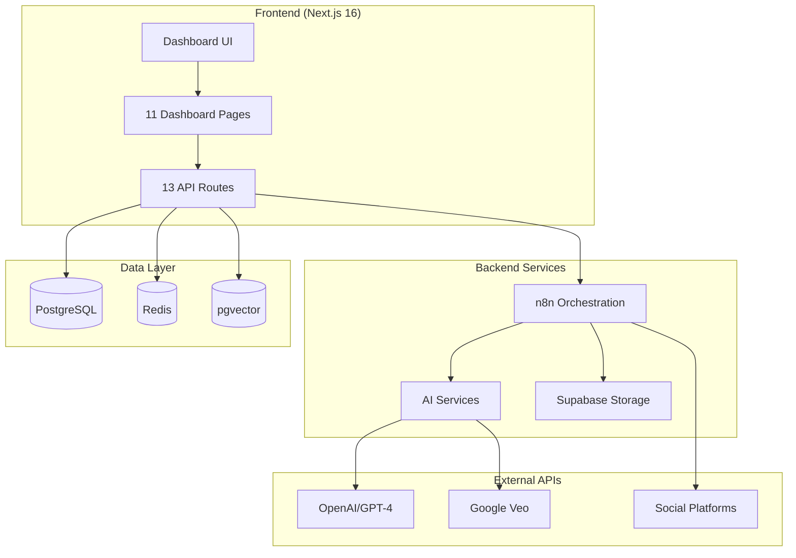
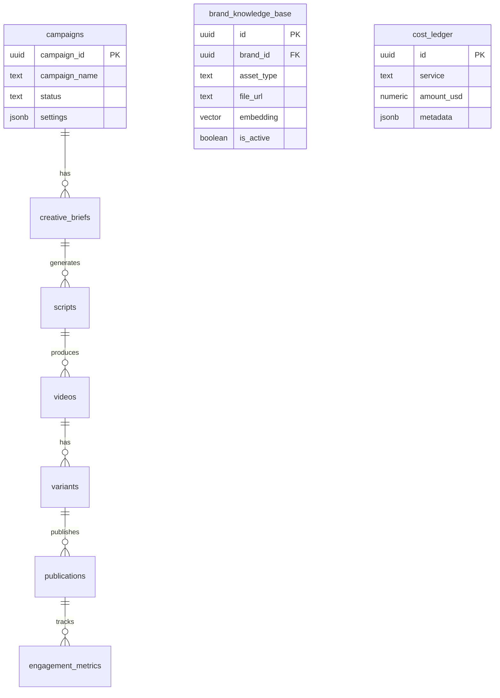

# Brand Infinity Engine - System Design Overview

## Executive Summary

A full-stack AI-powered content generation platform that automates video ad creation from strategy to publishing. Built with Next.js 16, Supabase, n8n workflows, and multi-model AI.

---

## Architecture Diagram



---

## Layer Breakdown

### 1. Frontend Layer

| Path              | Purpose                                        |
| :---------------- | :--------------------------------------------- |
| `/dashboard`      | Overview stats, activity feed                  |
| `/director`       | **Creative Director** - NLP prompt parsing     |
| `/brand-vault`    | Brand assets + identity (Assets/Identity tabs) |
| `/campaigns`      | Campaign CRUD, trigger generation              |
| `/campaigns/[id]` | Campaign detail view                           |
| `/review`         | Content approval with batch actions            |
| `/videos`         | Generated video library                        |
| `/distribution`   | Platform scheduling                            |
| `/publishing`     | Publication status                             |
| `/analytics`      | Performance metrics                            |
| `/settings`       | API keys, defaults                             |

### 2. API Layer (`/api/v1/`)

| Route                     | Methods                  | Purpose                      |
| :------------------------ | :----------------------- | :--------------------------- |
| `/campaigns`              | GET, POST                | List/create campaigns        |
| `/campaigns/[id]`         | GET, PATCH, DELETE       | Single campaign ops          |
| `/campaigns/[id]/trigger` | POST                     | Trigger n8n generation       |
| `/briefs`                 | GET                      | Creative briefs              |
| `/scripts`                | GET                      | Video scripts                |
| `/videos`                 | GET                      | Generated videos             |
| `/variants`               | GET                      | A/B test variants            |
| `/publications`           | GET                      | Published content            |
| `/reviews`                | GET, PATCH               | Review queue                 |
| `/analytics`              | GET                      | Metrics aggregation          |
| `/images`                 | GET, POST                | **DALL-E/Nano B generation** |
| `/brand-assets`           | GET, POST, PATCH, DELETE | **RAG assets**               |
| `/director`               | POST                     | **NLP prompt parsing**       |
| `/director/launch`        | POST                     | **Launch parsed campaign**   |
| `/health`                 | GET                      | System health check          |

### 3. AI Services (`/lib/ai/`)

| File       | Purpose                                        |
| :--------- | :--------------------------------------------- |
| `dalle.ts` | DALL-E 3 image generation (lazy-loaded client) |
| `nanob.ts` | Nano B fallback image generation               |
| `rag.ts`   | Vector embeddings + brand context retrieval    |

### 4. Database Schema (30 migrations)



**Key Tables:**

- `campaigns` - Campaign definitions
- `creative_briefs` - AI-generated creative concepts
- `scripts` - Video scripts with scenes
- `videos` / `generation_jobs` - Video generation tracking
- `variants` - A/B test versions
- `publications` / `platform_posts` - Publishing status
- `brand_knowledge_base` - RAG embeddings (Phase 6)
- `cost_ledger` - AI cost tracking

### 5. n8n Workflows

#### Main Workflows (12)

| Workflow                  | Trigger          | Purpose                           |
| :------------------------ | :--------------- | :-------------------------------- |
| `Strategist_Main`         | Campaign trigger | Trend research → brief generation |
| `Copywriter_Main`         | Brief approved   | Script generation with hooks      |
| `Production_Dispatcher`   | Script approved  | Dispatches to video models        |
| `Production_Poller`       | Scheduled        | Polls generation status           |
| `Production_Downloader`   | Video ready      | Downloads to storage              |
| `Video_Assembly`          | Assets ready     | Concatenates scenes               |
| `Approval_Handler`        | Manual           | Routes approval decisions         |
| `Broadcaster_Main`        | Approved         | Publishes to platforms            |
| `Campaign_Verifier`       | Scheduled        | Validates campaign state          |
| `Performance_Monitor`     | Scheduled        | Collects platform metrics         |
| `Circuit_Breaker_Monitor` | Scheduled        | Health monitoring                 |
| `Zombie_Reaper`           | Scheduled        | Cleans stuck jobs                 |

#### Sub-Workflows (8)

| Workflow                        | Purpose                    |
| :------------------------------ | :------------------------- |
| `Get_Brand_Context`             | RAG query for brand assets |
| `Log_Cost_Event`                | Records AI spend to ledger |
| `Acquire_Lock` / `Release_Lock` | Redis-based concurrency    |
| `Check_Circuit_Breaker`         | Fail-fast on errors        |
| `Send_Alert`                    | Slack/email notifications  |
| `Validate_Schema`               | Payload validation         |
| `Refresh_Platform_Token`        | OAuth refresh              |

---

## Data Flow

```
User Input (Creative Director)
    │
    ▼
┌─────────────────────────────────────────────────────────┐
│  1. NLP PARSING                                         │
│     /api/v1/director → GPT-4 → Structured Intent       │
└─────────────────────────────────────────────────────────┘
    │
    ▼
┌─────────────────────────────────────────────────────────┐
│  2. CAMPAIGN CREATION                                   │
│     /api/v1/director/launch → campaigns table          │
│     Triggers: Strategist_Main.json                     │
└─────────────────────────────────────────────────────────┘
    │
    ▼
┌─────────────────────────────────────────────────────────┐
│  3. CONTENT GENERATION                                  │
│     Strategist → Brief → Copywriter → Script           │
│     Uses: Get_Brand_Context (RAG)                      │
└─────────────────────────────────────────────────────────┘
    │
    ▼
┌─────────────────────────────────────────────────────────┐
│  4. VIDEO PRODUCTION                                    │
│     Production_Dispatcher → Veo/Sora API               │
│     Production_Poller → Status tracking                │
│     Video_Assembly → Final render                      │
└─────────────────────────────────────────────────────────┘
    │
    ▼
┌─────────────────────────────────────────────────────────┐
│  5. REVIEW & APPROVAL                                   │
│     /review page → Approval_Handler workflow           │
│     Inline editing, regeneration, batch actions        │
└─────────────────────────────────────────────────────────┘
    │
    ▼
┌─────────────────────────────────────────────────────────┐
│  6. PUBLISHING                                          │
│     Broadcaster_Main → TikTok, YouTube, Instagram      │
│     Performance_Monitor → Engagement tracking          │
└─────────────────────────────────────────────────────────┘
```

---

## Current Tech Stack

| Layer         | Technology                                         |
| :------------ | :------------------------------------------------- |
| Frontend      | Next.js 16, React 19, Tailwind, Framer Motion, SWR |
| Backend       | Next.js API Routes, Node.js                        |
| Database      | Supabase PostgreSQL, pgvector                      |
| Cache         | Redis (Upstash)                                    |
| Orchestration | n8n (self-hosted or cloud)                         |
| AI            | OpenAI GPT-4o, DALL-E 3, Google Veo                |
| Storage       | Supabase Storage                                   |
| Auth          | Supabase Auth (passcode-based)                     |
| Monitoring    | Sentry                                             |

---

## Known Gaps / Hardening Opportunities

| Area               | Current State       | Improvement                   |
| :----------------- | :------------------ | :---------------------------- |
| **Error Handling** | Basic try/catch     | Circuit breakers, retry logic |
| **Rate Limiting**  | Per-user Redis      | Add API-level throttling      |
| **Cost Tracking**  | Ledger table exists | Real-time dashboard widget    |
| **File Uploads**   | Placeholder only    | Supabase Storage integration  |
| **Testing**        | Minimal             | E2E tests for critical paths  |
| **Observability**  | Sentry errors       | Structured logging, metrics   |
| **n8n ↔ Frontend** | Webhook triggers    | Real-time status via SSE      |
| **Brand Context**  | localStorage        | Sync to Supabase              |
